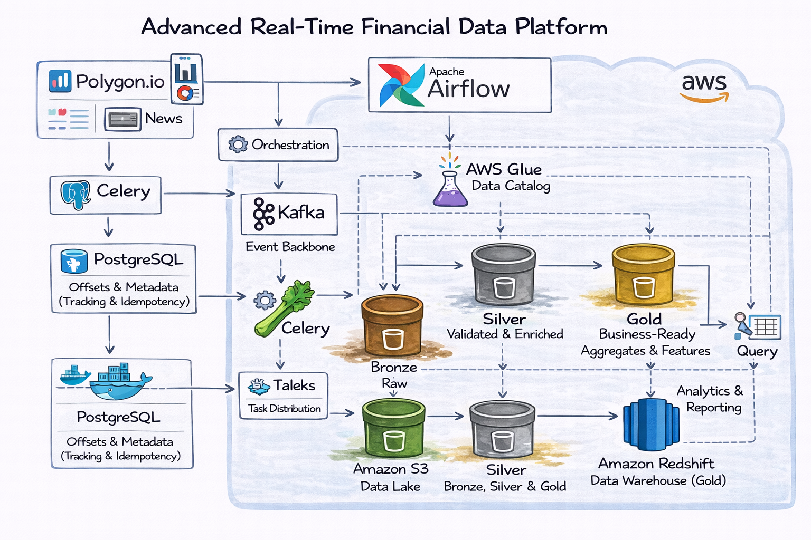

# **📊 Real-Time Market Surveillance Platform**

Event-driven market monitoring using Polygon.io, Kafka, Snowflake, dbt, and Airflow.

---

## **🚀 Overview**

This project implements a real-time market surveillance system designed to detect abnormal trading behavior using streaming market data.

The platform ingests market data from Polygon.io, processes it through Kafka, applies real-time filtering and enrichment, and stores curated datasets in Snowflake for analytics and reporting using dbt.

The system demonstrates a modern data architecture combining streaming, warehousing, and analytics engineering.

---

## **🎯 Use Case**

The platform focuses on practical financial monitoring use cases:

- Abnormal volume detection

- Volatility spike monitoring

- Price breakout and gap detection

- News-driven risk alerts

- Data quality and feed freshness monitoring

This mirrors real-world surveillance systems used in financial institutions and fintech companies.

--- 

## **🏗 Architecture**



### **Components**

**1️⃣ Data Source**

Polygon.io provides:

- 1-minute, 5-minute, hourly, and daily OHLCV bars

- Real-time news events

**2️⃣ Ingestion Layer**

- Celery workers parallelize symbol ingestion and backfills.

- Events are normalized and published to Kafka topics.

**3️⃣ Streaming Layer**

Kafka topics:

- `polygon.bars.raw`

- `polygon.news.raw`

- `market.alerts`

- `market.metrics`

Streaming processor:

- Filters noise

- Detects anomalies

- Aggregates rolling metrics

- Routes alerts

**4️⃣ Warehouse Layer (Snowflake)**

Schemas:

- `raw` – filtered streaming events

- `staging` – cleaned and typed views

- `analytics` – SCD2 dimensions and fact tables

**5️⃣ Transformation Layer (dbt)**

dbt builds:

- Dimension tables (SCD2)

- Fact tables (alerts, intraday metrics)

- Aggregated reporting tables

- Data quality tests

**6️⃣ Orchestration**

Airflow orchestrates:

- Backfills

- Batch transformations

- Snapshot jobs

- Quality checks

## **📂 Repository Structure**
```
.
├── docker-compose.yml
├── Makefile
├── airflow.env
├── dags/
├── streaming/
│   ├── polygon_producer.py
│   ├── stream_processor.py
├── dbt_project/
│   ├── models/
│   ├── snapshots/
├── config/
├── utils/
└── README.md
```
## **🔧 Technology Stack**

| Layer	             | Technology                                    |
|--------------------|-----------------------------------------------|
| Source	            | Polygon.io                                    |
| Streaming          | 	Apache Kafka                                 |
| Stream Processing	 | Spark Structured Streaming or Python consumer |
| Warehouse          | 	Snowflake                                    |
| Transformation     | 	dbt                                          |
| Orchestration      | 	Apache Airflow                               |
| Task Distribution	 | Celery + Redis                                |
|Database (Infra)	| PostgreSQL|

---

## **📈 Example Alert Rules**

**Abnormal Volume**

Trigger alert when: Current Volume > 3 × Rolling 20-period average volume

**Volatility Spike**

Trigger alert when: Rolling Standard Deviation > Historical 95th percentile

**News Impact**

Trigger alert when: Negative sentiment + Abnormal volume within 10 minutes

---

## **🗄 Snowflake Data Model**
**RAW Layer**

- `raw_bars`

- `raw_news`

- `raw_alerts`

- `raw_metrics`

**STAGING Layer**

- `stg_bars`

- `stg_news`

**ANALYTICS Layer**

- `dim_instruments`

- `dim_market_sessions`

- `fact_intraday_metrics`

- `fact_alerts`

# Getting Started
1. Generate Fernet key
```bash
make fernet
```

2. Start infrastructure
```bash
docker compose up -d --build
```

3. Access Services

Airflow UI: http://localhost:8080

AKHQ (Kafka UI): http://localhost:8088

**Environment Variables**

Two environment files are required:

`.env`

- Postgres credentials

- Snowflake credentials

- Airflow metadata DB credentials

`airflow.env`

- Executor configuration

- Broker URL

- Fernet key

# **📊 What This Project Demonstrates**

- Event-driven architecture

- Real-time stream processing

- Modern data warehouse modeling

- SCD2 implementation in dbt

- Infrastructure separation (app DB vs orchestration DB)

- Production-style containerized deployment

**📌 Future Enhancements**

- Real-time Slack or webhook alerting

- Feature store integration

- Backtesting framework

- CI/CD pipeline for dbt models

- Monitoring with Prometheus and Grafana